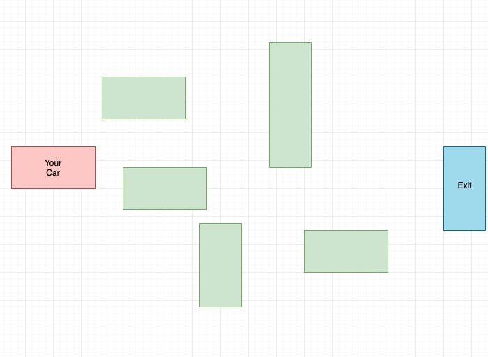
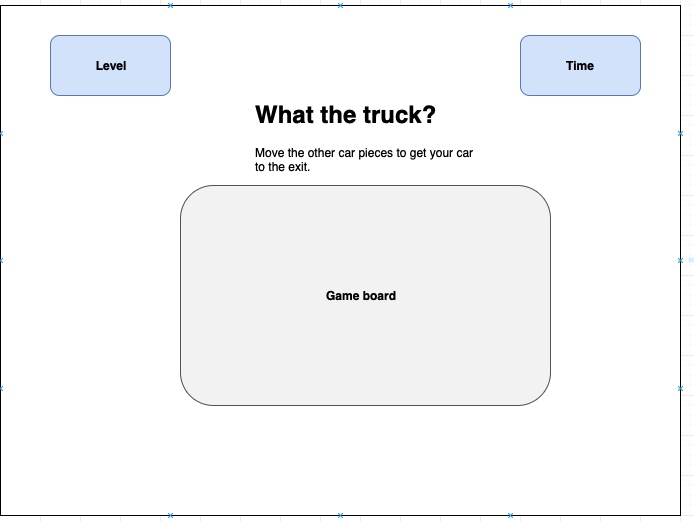

# Game-Project
This is the content for my game

**USER STORY**
1. As a user, I want to navigate my car (red) by maneuvering the other vehicles in a way that opens up the pathway to the exit
2. As a user, the vehicles can only travel vertically or horizontally, as far as there is empty space
3. As a user, I want to try to complete the 5 levels successfully, each level getting harder 

**TECHNOLOGIES USED**
1. HTML
2. CSS - planning on using a CSS Framework (like Bootstrap) for enhanced visuals/interaction
3. Javascript - DOM manipulation to make the car pieces interacive with the board

**APPROACH TAKEN**
- create the playing board/dimensions in html to map the movement for the cars
- use JS for movement of the cars & detect "win" with getting your car to the exit & progress to next level
- win condition: your car reaching/detected at the exit
- loss condition: maybe giving a set amount of time per level; or tracking time completion to the end & storing that time to challenge yourself or compare to another player

**INSTALLATION INSTRUCTIONS**

**UNSOLVED PROBLEMS**

**WIRE FRAME**

